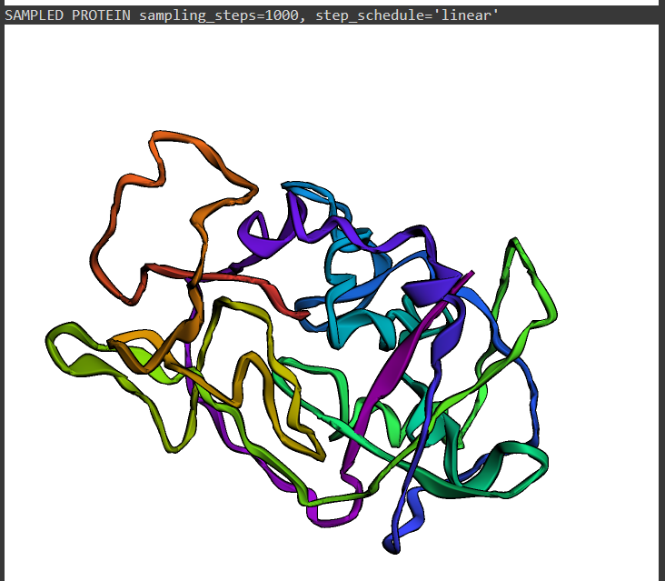
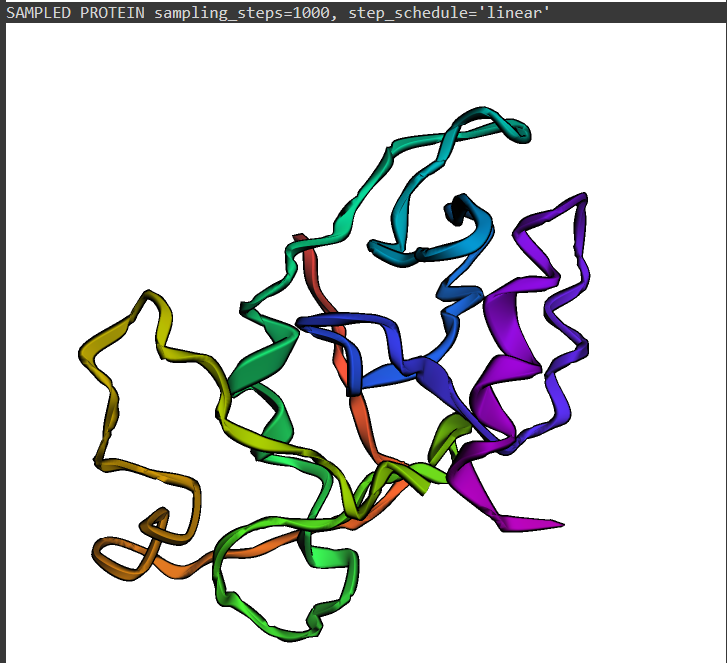
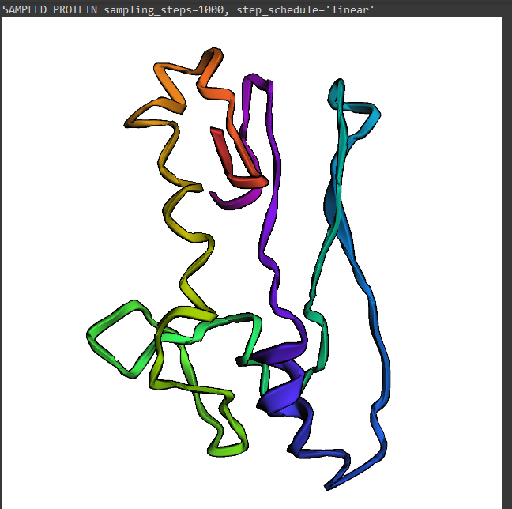
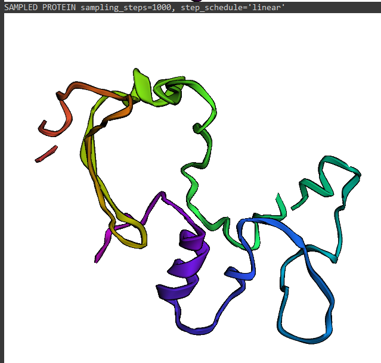

# Training from scratch a protein structure diffusion model on CATH dataset 


- The goal of this repo was to get familiar with protein & diffusion model training.

- Here are some notes I wrote on diffusion if you want to get familiar with it and be able to understand the code:
    - [Understanding the math and the notations](https://notes.haroldbenoit.com/ML/Generative-modeling-(Diffusion)/The-diffusion-process)
    - [Architecture specifics](https://notes.haroldbenoit.com/ML/Generative-modeling-(Diffusion)/Architecture/)
    - [The diffusion framework, why and how](https://notes.haroldbenoit.com/ML/Generative-modeling-(Diffusion)/Frameworks---Theory/)
    - [Training diffusion model](https://notes.haroldbenoit.com/ML/Generative-modeling-(Diffusion)/Training/)


## High-level summary


- The CATH dataset can be obtained from this [script](https://github.com/Mickdub/gvp/blob/master/data/getCATH.sh) or by downloading the files just below.

```bash
wget http://people.csail.mit.edu/ingraham/graph-protein-design/data/cath/chain_set.jsonl
wget http://people.csail.mit.edu/ingraham/graph-protein-design/data/cath/chain_set_splits.json
```

- Architecture is a DiT (Diffusion Transformer) from [Peebles & Xie (2022)](https://arxiv.org/abs/2212.09748)
    - DiT code inspired by https://github.com/facebookresearch/DiT

 - Diffusion tips and tricks inspired by [Würstchen (ICLR 2024, oral)](https://arxiv.org/abs/2306.00637) (for architecture and loss) and [Kadkhodaie et al.](https://arxiv.org/abs/2310.02557) (for choosing model size, Appendix B.4)
    - Diffusion code inspired by https://github.com/pabloppp/pytorch-tools/blob/master/torchtools/utils/diffusion.py and https://github.com/dome272/Wuerstchen/tree/main


- A trained checkpoint is available [here](https://drive.google.com/file/d/1a1BnqZRhnsQkZnk-aCvsEuM3FHfh-Z7Z/view?usp=drive_link)

- Wandb runs are available [here](https://wandb.ai/entropyy/protein-diffusion/workspace)

# Design decisions


## Architecture

For the architecture, I went with a transformer because of its ease to deal with variable length sequence data. The input will be the 4*3=12 atoms coordinates for each residue in the sequence. There are no embedded priors in the architecture, I assume the data is 3D point cloud.

* I took inspiration from the great work ["Scalable Diffusion Models with Transformers"](https://arxiv.org/abs/2212.09748)
  * One thing I particulary like is their transformer block to incoporate the conditioning (timestep, in our case) information. They incoporate what they call "adaLN-Zero" to learn the layernorm scale and shift factor, and also the gating before adding the attention and mlp to the residual stream. Additionally, at init time, we can easily init the "adaLN-Zero" block such that the DiT block is the identity function, which usually helps with training.

* Reimplemented the attention and MLP module as DiT code was using the timm libary.

* I also took inspiration from ["Wuerstchen: An Efficient Architecture for Large-Scale Text-to-Image Diffusion Models"](https://arxiv.org/abs/2306.00637) for the noise prediction.

  For simplicity reasons, I decided to predict expliclity only the mean of the noise, as (I think) we would need to optimize the variational lower bound too to predict the variance.

  Instead, like Wuerstchen, we implictly predict it (and assume it's diagonal) by doing what I call the "learned noise gating trick" which is to predict the noise $\bar \epsilon = \frac{x_t - A}{ |1-B| + 1e^{-5}}$ where $x_t =  \sqrt{\bar\alpha_t}x_{0} + \sqrt{1 - \bar\alpha_t}\epsilon_t)$, and $A,B = f_\theta(x_t,t)$, $A$ and $B$ have the same dimension as the noise $\epsilon$. The division is element-wise.
  Possible reasons as to why this works well are similar to "adaLN-Zero" i.e. at init time, the model initially returns the input, making the loss small for very noised inputs.


* For the positional embeddings, I went with the sinusoidal positional embeddings (I also tried learned positional embeddings, but performance was lower). The reasoning behind this choice is that (if I'm not wrong), residue sequences are not permutation invariant, thus we need some positional embeddings. However, I didn't go with [RoPE](https://arxiv.org/abs/2104.09864) , although it's very flexible, because the motivation behind RoPE is that the $QK^T$ inner product should only encode relative position information. This means that there is a decaying inter-token dependency with increasing relative distance. This inductive bias is well justified for language, however I don't think that's the case for protein sequences (because of folding interactions).


## Diffusion pipeline

It is quite simple. The design choices are:


*   We only have the DDPM and DDIM sampler
*    For training, we will thus use the standard mean-squared-error loss between the predicted noise and the ground truth noise. Additionally, we employ
  the [p2 loss weighting](https://arxiv.org/abs/2204.00227). This gives us: $\mathcal L = p_2(t) \cdot ||\epsilon - \bar \epsilon||^2$ where $p_2(t) = \frac{1 + \bar \alpha_t}{1- \bar \alpha_t}$. The higher the noise, the more it contributes to the loss.
*   We use the variance schedule from ["Improved Denoising Diffusion Probabilistic Models"](https://arxiv.org/abs/2102.09672)
*   We also implement the step schedule from ["Align Your Steps: Optimizing Sampling Schedules in Diffusion Models"](https://arxiv.org/abs/2404.14507), however we didn't find it to make a lot of difference, compared to a classic linear step schedule.


## Things I would add or maybe try

* Adjust the variance schedule, it uses an offset $s=0.008$ such that $\sqrt{\beta_0}$ was slightly smaller than the pixel bin size 1/127.5. So this is image-specific, we can most likely reduce this.
* Tweak the loss
  * Followig iDDPM, try to learn the variance of the noise $\Sigma_\theta$ and use a loss to also train  $\mathcal L = \mathcal L_{simple} + \lambda \mathcal L_{VLB}$ where $\mathcal L_{VLB}(\theta) \approx \sum_t D_{KL}(q(x_{t-1}|x_t,x_0)||p_\theta(x_{t-1}|x_t))$
    * Requires to tune $\lambda$ and must be careful with the implementation, as it's better to have stop grad between $\mathcal L_{VLB}$ and $\mu_\theta$.

## Training

Training code inspired by [Würstchen](https://github.com/dome272/Wuerstchen/tree/main), and previous code by me: https://github.com/HaroldBenoit/llm-baselines

* Tracked training runs with wandb

* Checkpointing and evaluation during training runs

* grad_clip=1.0, torch.compile(), no weight decay, 5% lr warmup and then very small decay over time, kept the same batch size and sequence length for simplicity,

The two metrics I tracked for my noise predictions are purely geometry-based (i.e. agnostic to protein function):
* mean squared error (usual diffusion loss)
* maximum absolute deviation (averaging could be hiding degenerate predictions, it could allow us to estimate an upper bound on the accumulative error during sampling)

There was usually no discrepancy between train and validation metrics. Final architecture config ([wandb run](https://wandb.ai/entropyy/protein-diffusion/runs/zag9nq9l?nw=nwuserentropyy)) is:

```
    n_layers: int = 8
    d_model: int = 384
    n_heads: int = 6

```

Smaller models performed worse, and larger models had loss spikes after ~15k iterations.


Final metrics:
* [train] loss_adjusted $\approx 0.07$, max_l1_error $\approx 0.35$
* [val] loss_adjusted $\approx 0.07$, max_l1_error $\approx 0.365$

## Things I would add or maybe try

* using EMA
  * cheap to do and apparently has quite an impact of performance
  *  good to tune the decay, there's a method to tune it post-hoc (approximately, but storage requirements are quite high) from "Analyzing and Improving the Training Dynamics of Diffusion Models"


# Main bug I encountered
- Don't forget to normalize the protein coordinates before adding unit gaussian noise, otherwise the scales may be wrong :) 


# Results

- Some resulting generations:





