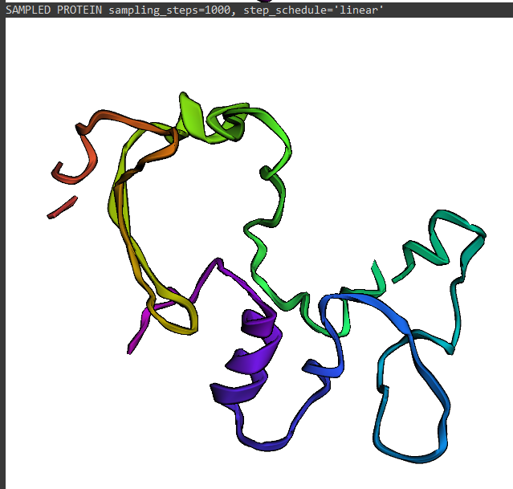

# Training from scratch a protein structure diffusion model on CATH dataset 

- The goal of this repo was to get familiar with protein & diffusion model training.

- My good friends at [Latent Labs](https://www.latentlabs.com/) have asked me to make the source code private, because candidates were copying this code and this was signficantly affecting their hiring pipeline.

- If you're interested in this code or want to discuss diffusion, please shoot me an email at (my first name)_(my last_name)@hotmail.ch

- To compensate, here are some notes I wrote on diffusion if you want to get familiar with it:
    - [Understanding the math and the notations](https://notes.haroldbenoit.com/ML/Generative-modeling-(Diffusion)/The-diffusion-process)
    - [Architecture specifics](https://notes.haroldbenoit.com/ML/Generative-modeling-(Diffusion)/Architecture/)
    - [The diffusion framework, why and how](https://notes.haroldbenoit.com/ML/Generative-modeling-(Diffusion)/Frameworks---Theory/)
    - [Training diffusion model](https://notes.haroldbenoit.com/ML/Generative-modeling-(Diffusion)/Training/)

- Also, here are some "pretty" generations from my trained model.

# Results

